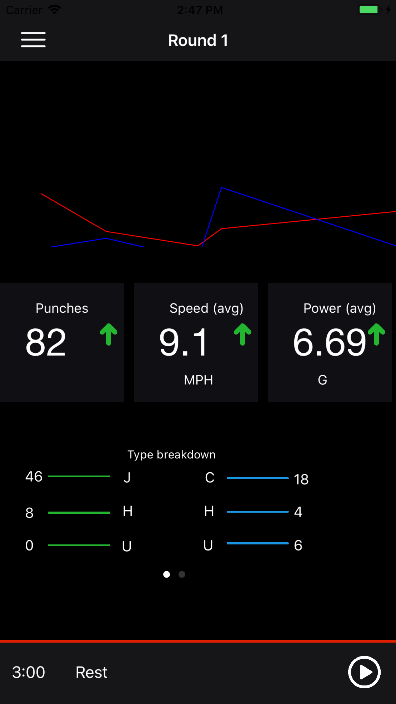

# CornerDemo
Demo app for a job application

# Image attributions

* increase by Rose Alice Design from the Noun Project

* Minus by Bluetip Design from the Noun Project

* play by David from the Noun Project

* pause by amantaka from the Noun Project

# Screenshots

# Notes

Uses cocopods, and to add run:

`pod install`

on your terminal in the project folder.

Please note, `SwiftCharts` will present 4 warnings regarding depreciated `flatMap`.

# Known points

* I really don't know how to do the graph using the data provided.  I've used a placeholder instead.
* The progress view doesn't seem in sync with the timer, and doesn't seem to be reducing the progress track correctly
* Some constraints are used, but others are not; the reason is that I found that they kept breaking and ended up not using them
* The up/down arrow images whilst included are not influenced by any data; I really wasn't sure how to do that.
